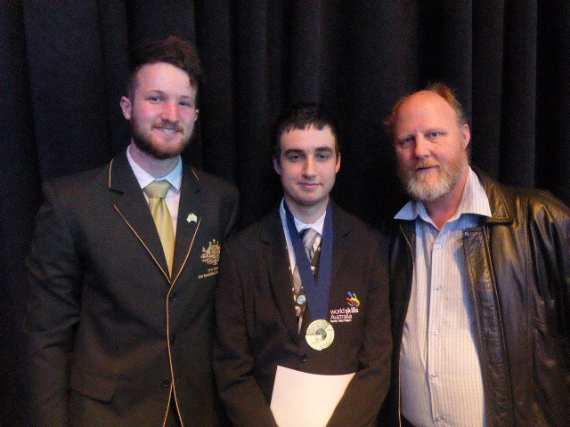

In October 2016, I attended the WorldSkills National Competition in Melbourne. It was a 3-day competition, with 4 separate modules spread out over the 3 days.

- The first module was a web design module, which consisted of creating an original full-page design, to fulfil a brief. 
- The second module was a client-side programming module, which required us to create a fully client-side app for sorting and filtering data in a table. 
- The third module was a server-side programming and database module, which allowed users to view, create, edit and delete data, only while logged in, and had to be protected against XSS attacks. 
- The final module was a responsive design challenge, where we had to create three different layouts for an original webpage design in Photoshop, for desktop, tablet and mobile phone sizes.

Pictured here is Harlan Wilton, previous medal winner and international competitor, and Colin Tyrrell, my TAFE teacher and coach for WorldSkills.

After the competition, an article was published in the [Blue Mountains Gazette](https://www.bluemountainsgazette.com.au/story/4238566/tafe-students-come-up-trumps).

